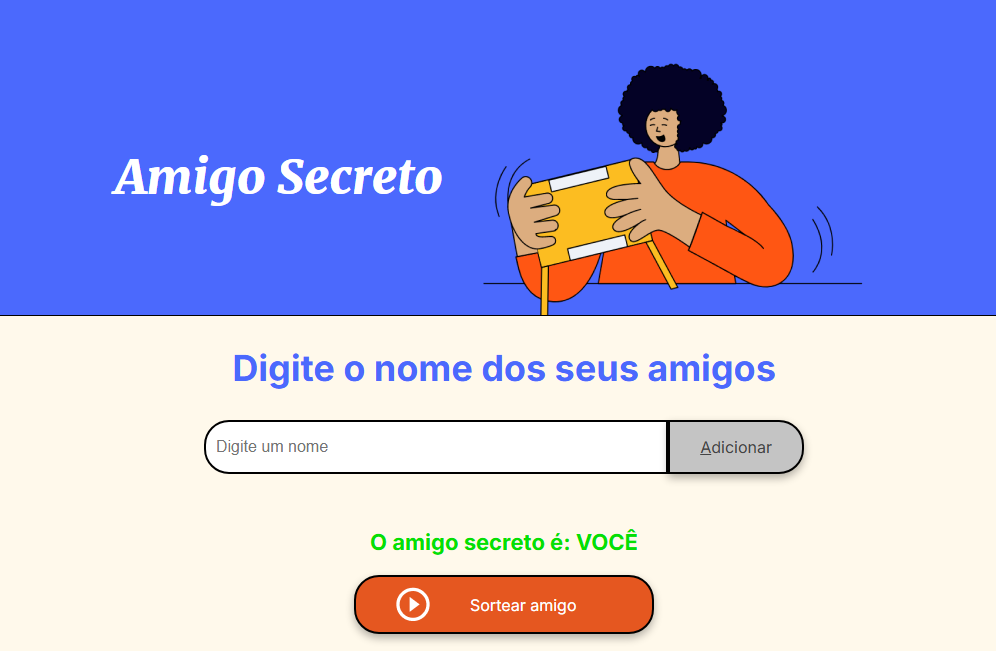

## Jogo do amigo secreto

  
Esta é uma aplicação onde você pode adicionar o nome de seus amigos numa lista e, depois, sortear seu amigo secreto. Ideal para brincadeiras de fim de ano.

Regra:
- Você não pode inserir um nome menor que dois caracteres.
- O nome deve ser único na lista.
- Insira um nome por vez.

Após digitar o nome do amigo ou amiga clique em "Adicionar" ou presione no teclado Alt+A para inseir o nome na lista.

Quando a lista tiver pronta clique em "Sortear amigo" e veja o nome sorteado na tela.

Divirta-se.

## Liguagens utilizadas

    

## Conecte-se comigo

     